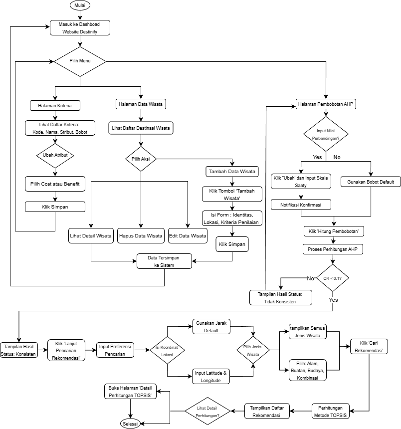

# Destinify

Sistem Rekomendasi Destinasi Wisata menggunakan metode AHP (Analytical Hierarchy Process) berbasis Laravel.

## Prasyarat

Pastikan sistem Anda sudah terinstall:

-   PHP >= 8.1
-   Composer
-   Node.js & NPM
-   SQLite (atau database lain sesuai preferensi)

## Cara Setup

### 1. Clone Repository

```bash
git clone https://github.com/FathimatusZN/destinify.git
cd destinify
```

### 2. Install Dependencies

```bash
# Install PHP dependencies
composer install

# Install Node.js dependencies
npm install
```

### 3. Konfigurasi Environment

```bash
# Copy file .env.example menjadi .env
cp .env.example .env

# Generate application key
php artisan key:generate
```

### 4. Konfigurasi Database

Buka file `.env` dan sesuaikan konfigurasi database. Untuk SQLite (default):

```env
DB_CONNECTION=sqlite
# DB_HOST=127.0.0.1
# DB_PORT=3306
# DB_DATABASE=laravel
# DB_USERNAME=root
# DB_PASSWORD=
```

Pastikan file `database/database.sqlite` sudah ada. Jika belum:

```bash
touch database/database.sqlite
```

Atau jika menggunakan MySQL/PostgreSQL, sesuaikan konfigurasi:

```env
DB_CONNECTION=mysql
DB_HOST=127.0.0.1
DB_PORT=3306
DB_DATABASE=destinify
DB_USERNAME=root
DB_PASSWORD=your_password
```

### 5. Migrasi Database & Seeding

```bash
# Jalankan migrasi dan seeder sekaligus
php artisan migrate:fresh --seed
```

**Apa yang di-seed?**

-   ✅ **5 Kriteria** penilaian (Biaya, Aksesibilitas, Fasilitas, Jarak, Rating) dengan bobot default
-   ✅ **25 Nilai perbandingan** kriteria AHP (matriks perbandingan berpasangan)
-   ✅ **103 Destinasi wisata** Jawa Timur lengkap dengan koordinat, harga, rating, dan fasilitas

Setelah seeding, Anda langsung bisa:

-   Melihat matriks perbandingan kriteria di halaman Pembobotan
-   Menggunakan sistem rekomendasi tanpa input data manual
-   Memodifikasi kriteria atau alternatif sesuai kebutuhan

### 6. Build Assets

```bash
# Development
npm run dev

# Atau untuk production
npm run build
```

### 7. Jalankan Aplikasi

```bash
# Jalankan Laravel development server
php artisan serve
```

Aplikasi akan berjalan di `http://localhost:8000`

## Struktur Database

Aplikasi ini menggunakan beberapa tabel utama:

-   `tb_kriteria` - Data kriteria penilaian (5 kriteria dengan bobot)
-   `tb_alternatif` - Data destinasi wisata (103 destinasi Jawa Timur)
-   `tb_rel_kriteria` - Relasi perbandingan kriteria AHP (25 pasangan)
-   `tb_user_input` - Input preferensi user
-   `tb_hasil_perhitungan` - Hasil perhitungan rekomendasi

## Struktur Folder

```
destinify/
├── app/
│   ├── Http/
│   │   └── Controllers/
│   │       ├── AlternatifController.php
│   │       ├── KriteriaController.php
│   │       ├── PembobotanController.php
│   │       ├── RekomendasiController.php
│   │       └── ...
│   └── Models/
│       ├── Alternatif.php
│       ├── Kriteria.php
│       ├── RelKriteria.php
│       └── ...
├── database/
│   ├── migrations/
│   │   ├── 2025_01_01_000001_create_tb_kriteria_table.php
│   │   ├── 2025_01_01_000002_create_tb_alternatif_table.php
│   │   ├── 2025_01_01_000004_create_tb_rel_kriteria_table.php
│   │   └── ...
│   ├── seeders/
│   │   ├── sql/
│   │   │   └── tb_alternatif.sql
│   │   ├── AlternatifSeeder.php
│   │   ├── KriteriaSeeder.php
│   │   ├── RelKriteriaSeeder.php
│   │   └── DatabaseSeeder.php
│   └── database.sqlite
├── resources/
│   └── views/
│       ├── alternatif/
│       ├── kriteria/
│       ├── pembobotan/
│       └── rekomendasi/
├── routes/
│   └── web.php
└── README.md
```

## Fitur Utama

-   **Dashboard**: Tampilan utama aplikasi dengan ringkasan data
-   **Master Kriteria**: Kelola 5 kriteria penilaian destinasi
-   **Master Alternatif**: Kelola 103 data destinasi wisata Jawa Timur
-   **Pembobotan AHP**:
    -   Matriks perbandingan kriteria langsung dari database
    -   Perhitungan otomatis Lambda Max, CI, dan CR
    -   Validasi konsistensi AHP (CR < 0.1)
-   **Rekomendasi**: Sistem rekomendasi destinasi berdasarkan preferensi user dengan SAW

## Cara Kerja Sistem



### 1. Pembobotan Kriteria (AHP)

-   Input nilai perbandingan antar kriteria (skala 1-9)
-   Sistem otomatis menghitung bobot dan konsistensi
-   Data tersimpan di database dan langsung terlihat di matriks

### 2. Input Preferensi User

-   User memasukkan preferensi untuk setiap kriteria
-   Sistem melakukan normalisasi data alternatif

### 3. Perhitungan Rekomendasi (SAW)

-   Mengalikan nilai ternormalisasi dengan bobot kriteria
-   Mengurutkan hasil dari tertinggi ke terendah
-   Menampilkan top destinasi yang sesuai

## Troubleshooting

### Matriks Pembobotan Kosong

Jika matriks perbandingan kriteria tidak muncul:

```bash
php artisan db:seed --class=RelKriteriaSeeder
```

### Data Alternatif Tidak Ada

Jika tidak ada data destinasi wisata:

```bash
php artisan db:seed --class=AlternatifSeeder
```

### Reset Database Lengkap

```bash
php artisan migrate:fresh --seed
```

### Error: "Permission denied" saat migrasi

```bash
# Berikan permission untuk folder storage dan bootstrap/cache
chmod -R 775 storage bootstrap/cache
```

### Error saat `composer install`

```bash
# Hapus folder vendor dan composer.lock, lalu install ulang
rm -rf vendor composer.lock
composer install
```

### Assets tidak muncul

```bash
# Clear cache dan rebuild assets
php artisan cache:clear
php artisan config:clear
npm run build
```

## Teknologi yang Digunakan

-   **Framework**: Laravel 11.x
-   **Frontend**: Blade Templates, Tailwind CSS, Vite
-   **Database**: SQLite (default) / MySQL / PostgreSQL
-   **Metode Decision Support**:
    -   AHP (Analytical Hierarchy Process) untuk pembobotan kriteria
    -   SAW (Simple Additive Weighting) untuk perhitungan rekomendasi

## Data Wisata

Sistem ini sudah dilengkapi dengan **103 destinasi wisata Jawa Timur** meliputi:

-   🏞️ Wisata Alam (air terjun, gunung, pantai, taman nasional)
-   🏛️ Wisata Budaya (candi, museum, situs sejarah)
-   🎡 Wisata Buatan (taman rekreasi, kebun binatang, alun-alun)

Setiap destinasi memiliki data lengkap:

-   Koordinat GPS (latitude, longitude)
-   Link Google Maps
-   Biaya masuk
-   Rating pengunjung
-   Skor aksesibilitas (1-5)
-   Skor fasilitas (1-5)
-   Jarak default dari Surabaya

## Kontribusi

Jika Anda ingin berkontribusi:

1. Fork repository ini
2. Buat branch baru (`git checkout -b feature/AmazingFeature`)
3. Commit perubahan (`git commit -m 'feat: add some AmazingFeature'`)
4. Push ke branch (`git push origin feature/AmazingFeature`)
5. Buat Pull Request

## Lisensi

Distributed under the MIT License.

## Kontak

[@FathimatusZN](https://github.com/FathimatusZN)

---

**Destinify** - Temukan Destinasi Wisata Terbaik di Jawa Timur 🌴
